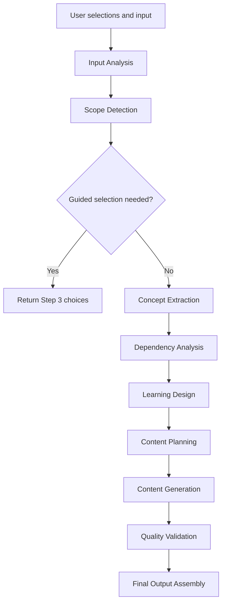

# LearnCraft AI

LearnCraft AI transforms topics and documents into structured learning experiences tailored for learning, teaching, implementation, interview preparation, and focused exploration.

The project is currently in the Planning & Design phase, with emphasis on product specification, user flow, prompt architecture, evaluation design, and future Microsoft Copilot Studio implementation.

---

## Project Overview

LearnCraft AI helps users turn a topic, uploaded document, or topic plus document into immediately usable learning content.

The system is designed to generate:

- Lecture-ready presentations
- Study guides
- Focused deep dives
- Implementation-ready learning content

Instead of returning generic summaries, LearnCraft AI uses a guided 3-step workflow and a single-agent prompt architecture to produce structured learning experiences that match the user's selected goal.

---

## Problem Statement

Generative AI can explain almost any topic, but users still face common learning and preparation problems:

- Content is often unstructured.
- Broad topics produce shallow overviews.
- Users may not know which prerequisites matter.
- Teaching material requires manual restructuring.
- Implementation guidance is often mixed with theory.
- Interview preparation needs high-frequency concepts and misconceptions.
- Document summaries rarely become usable learning experiences.

LearnCraft AI addresses these issues by adapting content generation to mode, output type, learning objective, topic scope, and source material.

---

## Solution

LearnCraft AI provides a selection-based workflow that turns user intent into tailored learning content.

The system:

- Detects whether a topic is broad, ambiguous, or multi-topic.
- Extracts and ranks concepts from uploaded files.
- Uses contextual prerequisite injection instead of prerequisite chapters.
- Generates an internal content plan before writing.
- Produces final outputs aligned to the selected mode, output type, and learning objective.
- Validates content to avoid generic summaries and repeated background explanations.

---

## Features

- Maximum 3-step workflow
- Selection-based navigation
- Topic input, file upload, or topic plus file
- Scope detection for broad, ambiguous, and multi-topic inputs
- Concept extraction and concept ranking from files
- Learning Objective selection:
  - Learn
  - Teach
  - Implement
  - Interview
  - Explore
- Contextual prerequisite injection
- Lecture-ready presentation generation
- Study guide generation
- Focused deep dive generation
- Implementation-ready output structure
- Quality validation rules for prompt engineering

---

## Architecture Overview

LearnCraft AI uses a single-agent prompt architecture.

The internal reasoning pipeline is:

1. Input Analysis
2. Scope Detection
3. Concept Extraction
4. Dependency Analysis
5. Learning Design
6. Content Planning
7. Content Generation
8. Quality Validation
9. Final Output Assembly



Architecture documents:

- [Product Specification](docs/product-spec/Product_Spec_v1.md)
- [User Flow](docs/Ui-Design/User_Flow.md)
- [Prompt Architecture](docs/architecture/Prompt_Architecture.md)
- [System Prompt](prompts/System_Prompt_v1.md)
- [Evaluation Test Cases](evaluation/Test_Cases_v1.md)

---

## User Workflow

LearnCraft AI keeps the user experience to a maximum of 3 steps.

### Step 1: Select Mode

Users select one mode:

- Lecture-Ready Presentation Pack
- Study Guide
- Focused Deep Dive

### Step 2: Provide Input

Users provide:

- Topic
- File upload
- Topic plus file

### Step 3: Select Output

Users select:

- Output type
- Learning Objective
- Any required guided scope, concept, interpretation, or file alignment choice

The system then generates the final learning content.

---

## Output Types

### Lecture-Ready Presentation Pack

- Slides Only
- Slides + Speaker Notes
- Full Presentation Pack

### Study Guide

- Quick Learning
- Solid Understanding
- Deep Learning
- Implementation Ready

### Focused Deep Dive

- Lecture Style
- Study Guide
- Advanced Concept Brief
- Just One Topic

---

## Tech Stack

Initial platform:

- Microsoft Copilot Studio
- Azure OpenAI

Planned supporting components:

- Adaptive Cards
- Power Platform
- Power Automate
- Document ingestion
- Presentation generation
- Prompt evaluation framework

---

## Current Status

Current phase: Planning & Design.

Completed planning artifacts:

- Product specification v1
- User flow design
- Prompt architecture
- Production-oriented system prompt draft
- Evaluation test cases v1

Next priority areas:

- Copilot Studio conversation and action design
- Prompt template implementation
- Evaluation harness
- Prototype generation flows

---

## Future Roadmap

- Build Copilot Studio prototype.
- Implement topic and file input flow.
- Add Step 3 guided selection cards.
- Implement scope detection prompt.
- Implement file concept extraction and ranking.
- Generate lecture, study, deep dive, and implementation-ready outputs.
- Add evaluation workflow using documented test cases.
- Add presentation export support.
- Add feedback loop for output refinement.
- Validate with students, professionals, trainers, and interview candidates.

---

## Repository Structure

```text
docs/
  architecture/
  product-spec/
  Ui-Design/
evaluation/
prompts/
src/
assets/
```

---

## Design Principles

- No generic summaries.
- No chat-style interaction.
- Maximum 3-step workflow.
- Selection-based navigation.
- Contextual prerequisite injection.
- Topic scope detection.
- Objective-aware generation.
- Structured learning experiences over information dumps.

