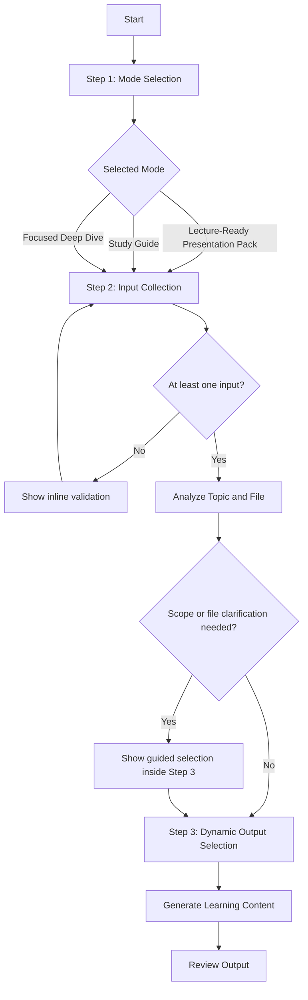
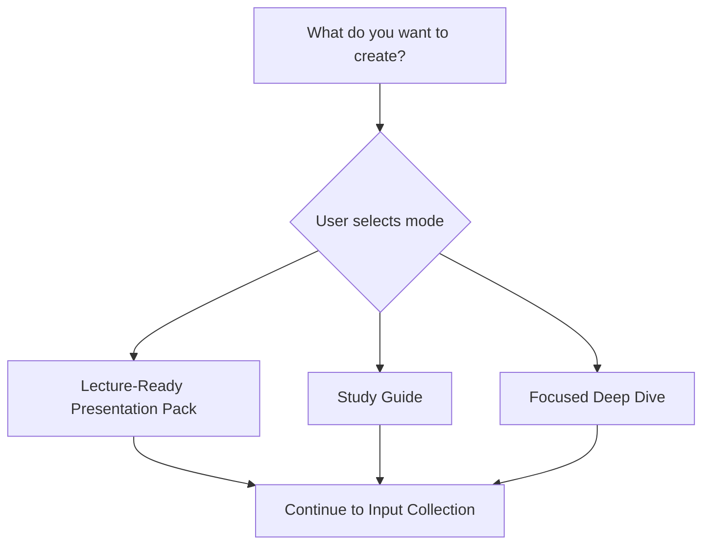
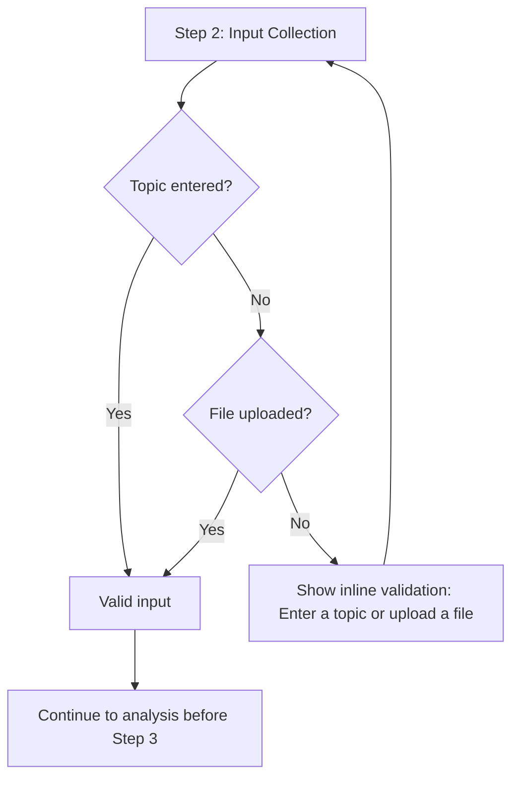
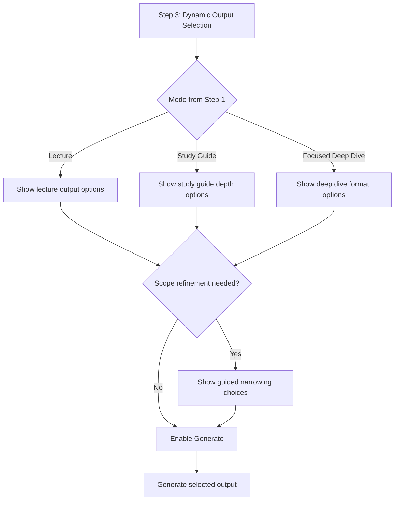
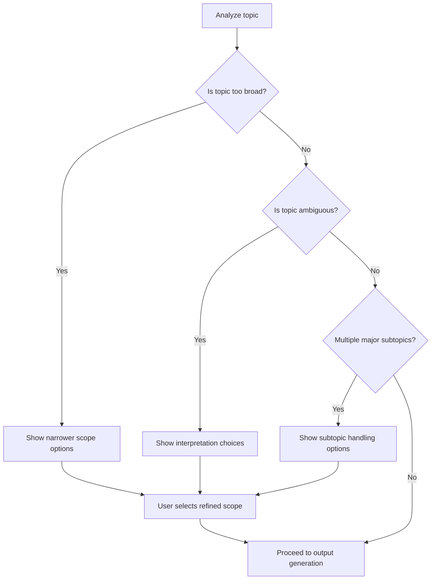
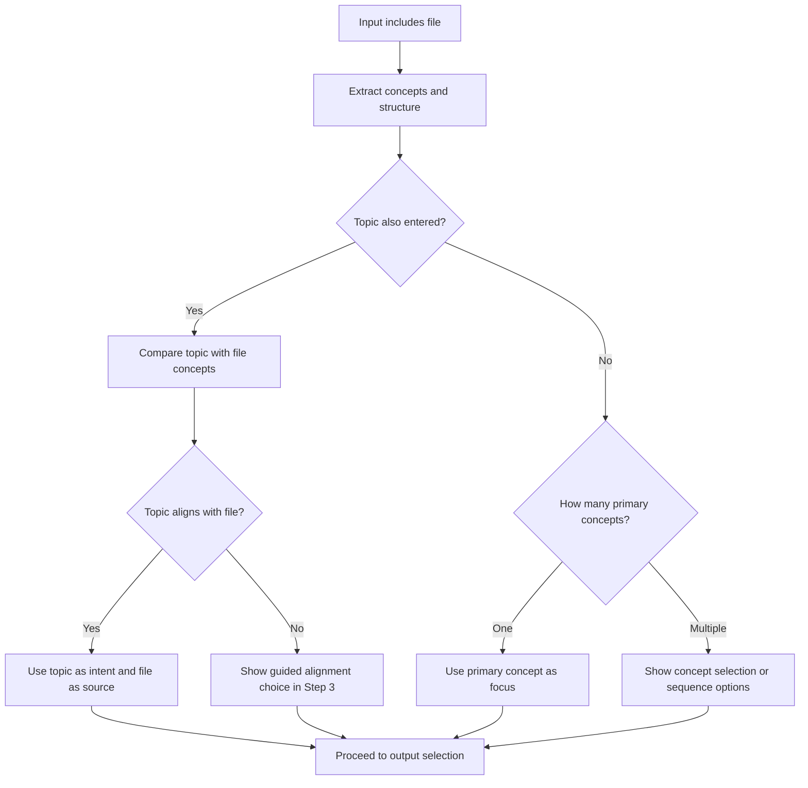
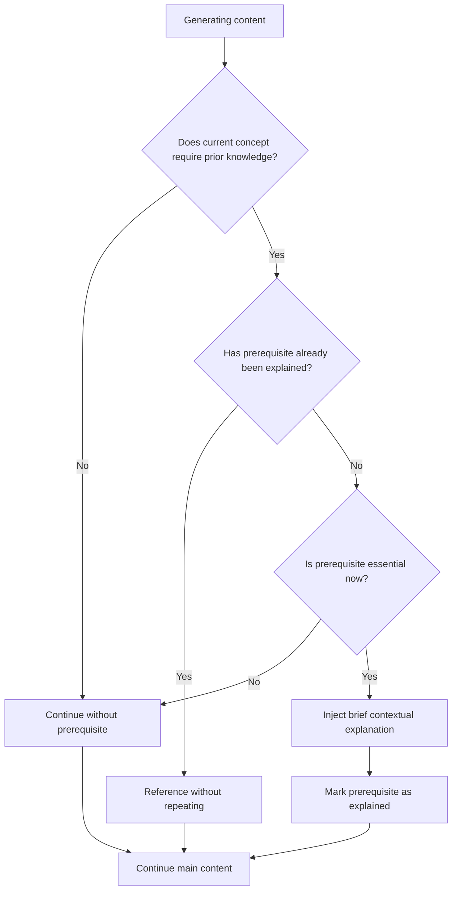
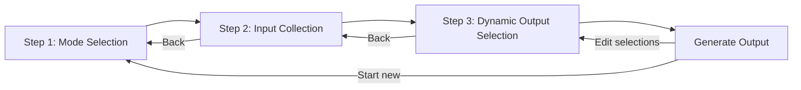
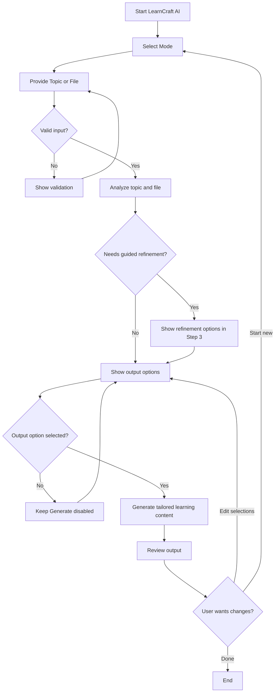

# LearnCraft AI - User Flow

## Purpose

This document defines the complete user journey for LearnCraft AI. The experience is intentionally limited to a maximum 3-step workflow, uses selection-based navigation, and avoids chat-style interaction.

LearnCraft AI guides users from learning intent to usable output through:

1. Mode Selection
2. Input Collection
3. Dynamic Output Selection

Scope clarification, file interpretation, and prerequisite handling happen inside this workflow without adding extra user-facing steps.

---

## Workflow Overview

---

## Step 1: Mode Selection

### Goal

Capture the user's intended learning outcome before asking for content input.

### Screen Description

The user sees three selectable mode options:

- Lecture-Ready Presentation Pack
- Study Guide
- Focused Deep Dive

Each option should appear as a clear selection control with a short purpose label. The screen should not include a free-form chat box.

### Mode Behavior

| Mode | User Intent | Downstream Impact |
| --- | --- | --- |
| Lecture-Ready Presentation Pack | Prepare teaching or presentation material | Step 3 shows lecture-specific output formats |
| Study Guide | Learn or revise a subject in structured depth | Step 3 shows learning depth options |
| Focused Deep Dive | Explore a narrow concept or subtopic | Step 3 shows focused explanation formats |

### User Decision Tree

### Rules

- Exactly one mode must be selected.
- The Next button remains disabled until a mode is selected.
- The selected mode is preserved if the user moves back from later steps.

---

## Step 2: Input Collection

### Goal

Collect the source material LearnCraft AI will transform into a learning experience.

### Screen Description

The user can provide any of the following:

- Enter Topic
- Upload File
- Enter Topic + Upload File

The screen includes:

- Topic input field
- File upload control
- Supported file guidance
- Inline validation area
- Back button
- Next button

### Validation

At least one input is required.

| Input State | Result |
| --- | --- |
| No topic and no file | Show validation message and keep user on Step 2 |
| Topic only | Continue with topic analysis |
| File only | Continue with file concept extraction |
| Topic + file | Continue with combined topic and file analysis |

### Validation Flow

### Rules

- The user may continue with a topic, a file, or both.
- Validation is inline and selection-based.
- The workflow must not ask open-ended clarification questions.
- Uploaded file state and entered topic text are preserved when navigating back.

---

## Step 3: Dynamic Output Selection

### Goal

Let the user choose the final output format based on the mode selected in Step 1.

Step 3 may also include guided narrowing controls when LearnCraft AI detects broad, ambiguous, or multi-topic input. These controls are part of Step 3 and do not create a fourth step.

### Lecture-Ready Presentation Pack Options

- Slides Only
- Slides + Speaker Notes
- Full Presentation Pack

| Option | Output Behavior |
| --- | --- |
| Slides Only | Generates slide titles, bullet content, and visual guidance |
| Slides + Speaker Notes | Generates slides with presenter explanations for each slide |
| Full Presentation Pack | Generates slides, speaker notes, learning objectives, section flow, examples, recap, and suggested activities |

### Study Guide Options

- Quick Learning
- Solid Understanding
- Deep Learning
- Implementation Ready

| Option | Output Behavior |
| --- | --- |
| Quick Learning | Prioritizes essential concepts, definitions, and fast recall |
| Solid Understanding | Adds structured explanation, examples, and conceptual links |
| Deep Learning | Adds deeper reasoning, edge cases, misconceptions, and layered examples |
| Implementation Ready | Adds practical steps, applied examples, checklists, and implementation guidance |

### Focused Deep Dive Options

- Lecture Style
- Study Guide
- Advanced Concept Brief
- Just One Topic

| Option | Output Behavior |
| --- | --- |
| Lecture Style | Explains the selected focus area as teachable lecture content |
| Study Guide | Explains the focus area as learner-facing study material |
| Advanced Concept Brief | Produces concise expert-level analysis of the concept |
| Just One Topic | Restricts output to a single selected topic with no broad expansion |

### Dynamic Output Flow

### Rules

- Output options depend only on the selected mode.
- Exactly one output option must be selected.
- If scope narrowing is required, the Generate button remains disabled until a valid scope choice is selected.
- Previous mode and input selections remain available through the Back button.

---

## Topic Scope Detection

### Purpose

LearnCraft AI detects whether the requested topic is suitable for immediate generation or needs guided narrowing. This prevents generic summaries and keeps the output aligned with the user's intent.

### Scope Detection States

| Detection State | Example | Behavior |
| --- | --- | --- |
| Topic is too broad | Machine Learning | Show guided scope options in Step 3 before generation |
| Topic is ambiguous | Java | Ask the user to choose from detected interpretations |
| Topic contains multiple major subtopics | Neural networks, decision trees, and reinforcement learning | Ask the user to select one subtopic, prioritize all, or generate a structured sequence |

### Too Broad Topic Behavior

When a topic is too broad:

- Do not generate a generic overview.
- Show suggested narrower scopes.
- Keep the user inside Step 3.
- Allow the user to choose a recommended scope or enter a narrower topic.

Example guided choices for "Machine Learning":

- Machine Learning fundamentals
- Supervised learning basics
- Model training workflow
- Machine learning for business users
- Enter narrower topic

### Ambiguous Topic Behavior

When a topic is ambiguous:

- Show detected meanings as selectable options.
- Do not ask a chat-style clarification question.
- Use the user's selected meaning for generation.

Example guided choices for "Java":

- Java programming language
- Java platform and JVM
- Java island
- Enter more specific topic

### Multiple Major Subtopics Behavior

When a topic contains multiple major subtopics:

- Identify the major subtopics.
- Let the user choose how to proceed.
- Preserve the original input.

User options:

- Focus on one subtopic
- Generate a structured sequence covering all subtopics
- Prioritize the most foundational subtopic first

### Topic Scope Decision Tree

---

## File Processing Flow

### Purpose

LearnCraft AI analyzes uploaded files to identify concepts, learning structure, and topic focus before generating content.

### File Processing States

| File State | Behavior |
| --- | --- |
| File contains multiple concepts | Extract concept list and show concept selection or sequence options in Step 3 |
| File contains one primary concept | Use the primary concept as the generation focus |
| User uploads topic + file | Use the topic as the user intent and the file as source/context |

### File Contains Multiple Concepts

When a file contains multiple concepts:

- Detect major concepts and sections.
- Show selectable concept options in Step 3.
- Allow the user to select one concept or generate a structured learning path across concepts.
- Avoid summarizing the whole file generically.

User options:

- Focus on one detected concept
- Create a structured sequence from all concepts
- Prioritize concepts most relevant to the selected mode

### File Contains One Primary Concept

When a file contains one primary concept:

- Use the primary concept as the scope.
- Extract supporting examples, definitions, procedures, and key insights.
- Continue directly to output selection unless the concept is still too broad or ambiguous.

### User Uploads Topic + File

When the user provides both topic and file:

- Treat the topic as the target learning intent.
- Treat the file as grounding material.
- Prefer file content when it directly supports the topic.
- Ignore unrelated file sections unless needed for brief context.
- If the topic and file conflict, show a Step 3 guided choice.

Conflict options:

- Use topic as primary focus
- Use file as primary focus
- Use only file sections related to topic

### File Processing Diagram

---

## Prerequisite Handling

### Principle

LearnCraft AI uses contextual prerequisite injection. It does not create prerequisite chapters or separate background sections.

### Rules

- No prerequisite chapters.
- Inject explanations only when needed.
- Keep prerequisite explanations brief.
- Never repeat prerequisite explanations.
- Place prerequisite explanations near the concept that requires them.
- Skip prerequisite explanations when the concept is already understandable from context.

### Injection Behavior

| Situation | Behavior |
| --- | --- |
| A required concept appears for the first time | Add a short inline explanation |
| The same prerequisite appears again | Reference it naturally without re-explaining |
| A prerequisite is useful but not essential | Omit it |
| A prerequisite would require long explanation | Add a brief bridge explanation and continue with the main topic |

### Prerequisite Decision Tree

---

## Navigation Rules

### Back Button

The Back button is supported on Steps 2 and 3.

### Preservation Rules

When the user navigates backward:

- Previous selections are preserved.
- Entered topic text is preserved.
- Uploaded file state is preserved.
- Output selection is preserved when still compatible with the selected mode.
- Scope refinement choices are preserved when still compatible with the updated input.

### Change Handling

| User Action | System Behavior |
| --- | --- |
| User changes mode in Step 1 | Step 3 output options reset to match the new mode |
| User changes topic in Step 2 | Scope analysis refreshes |
| User removes uploaded file | File-derived concept choices are removed |
| User changes file | File processing refreshes |
| User returns to Step 3 without changing earlier inputs | Previous Step 3 choices remain selected |

### Restart Rule

The user never restarts the workflow unnecessarily. Restart is only required when the user explicitly chooses to start a new learning experience after output generation.

### Navigation Diagram

---

## Complete Screen-by-Screen Journey

### Screen 1: Mode Selection

User action:

- Select one learning mode.

System response:

- Highlights selected mode.
- Enables Next.
- Stores mode selection.

Exit condition:

- One mode is selected.

### Screen 2: Input Collection

User action:

- Enter a topic, upload a file, or provide both.

System response:

- Validates that at least one input exists.
- Stores topic and file.
- Performs topic and file analysis after the user continues.

Exit condition:

- Topic, file, or topic + file is provided.

### Screen 3: Dynamic Output Selection

User action:

- Select output type.
- Select any required scope, interpretation, concept, or alignment option.

System response:

- Shows output options based on selected mode.
- Shows guided narrowing controls only when needed.
- Enables Generate after required selections are complete.

Exit condition:

- Output option is selected.
- Required scope or file clarification selections are complete.

### Output Review Screen

User action:

- Review generated learning content.
- Go back to adjust selections or start a new learning experience.

System response:

- Displays generated output.
- Preserves workflow state for edits.
- Starts a clean workflow only when the user chooses Start New.

---

## End-to-End Decision Tree

---

## Design Constraints

- The workflow must remain 3 steps maximum.
- All clarification must be selection-based.
- The product must avoid chat-style interaction.
- The system must not generate generic summaries.
- The generated output must match the selected mode, input, output option, and detected scope.
- Topic scope detection and file processing must support user choice without adding extra workflow steps.
- Prerequisite explanations must be contextual, brief, non-repetitive, and never separated into standalone chapters.
