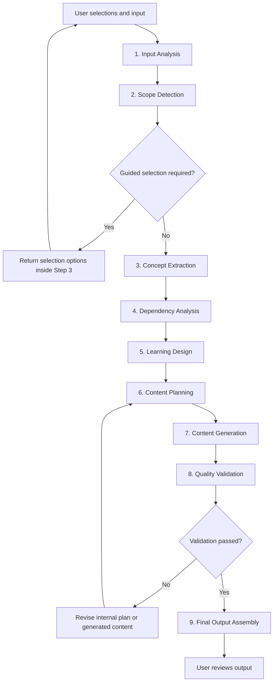
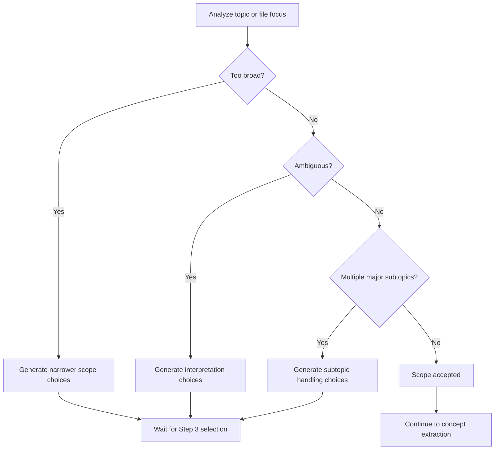
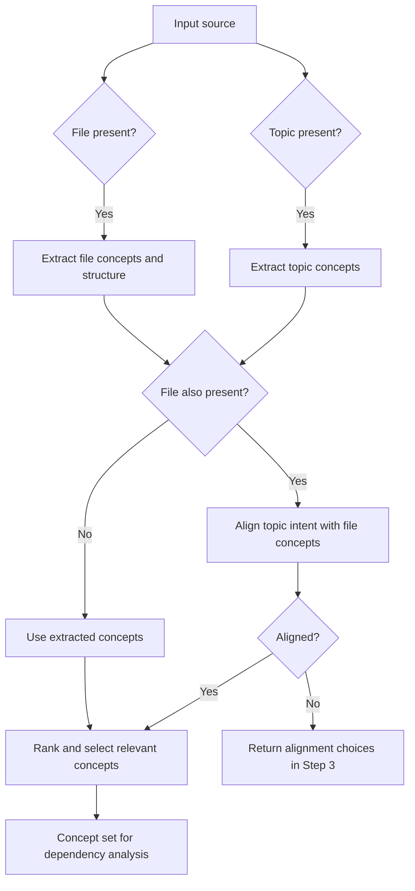
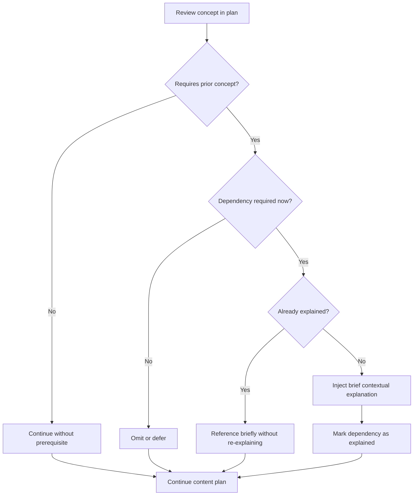
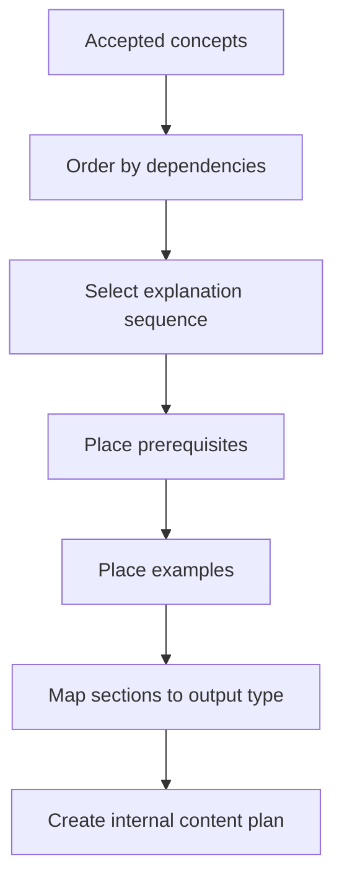
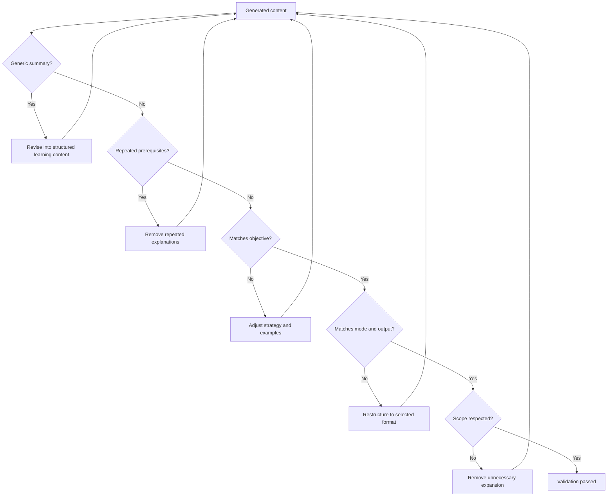
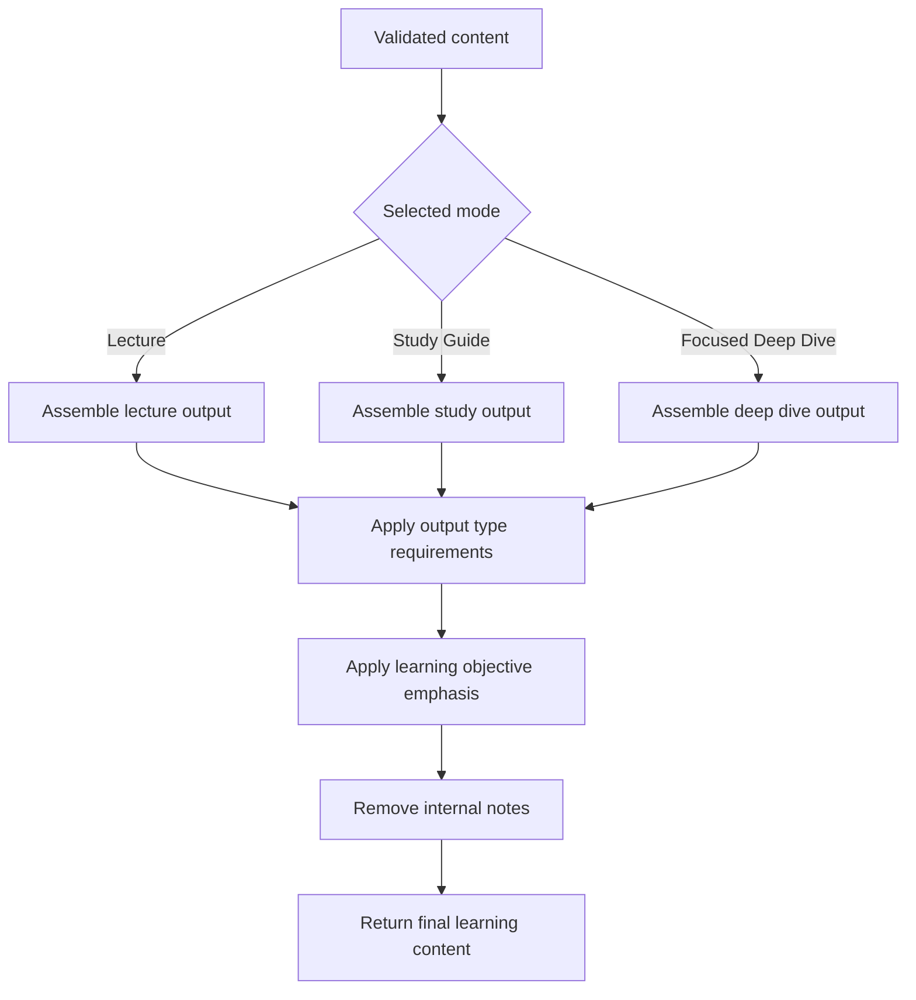
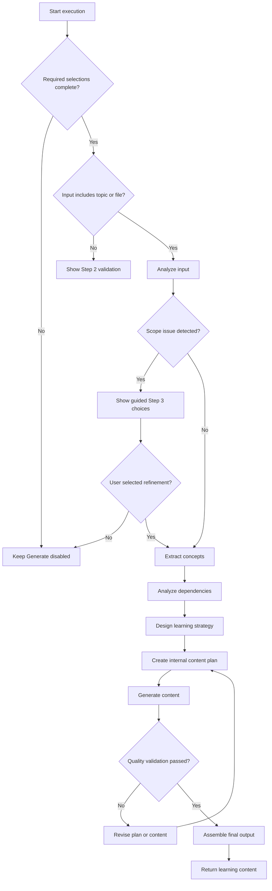

# LearnCraft AI - Prompt Architecture

## Purpose

This document defines how LearnCraft AI reasons internally before generating learning content.

The architecture is designed as a single-agent prompt pipeline. One reasoning system performs analysis, planning, generation, validation, and final assembly. The system must not be decomposed into multiple agents.

The document is implementation-oriented and intended to support future system prompt design, prompt templates, evaluation criteria, and Copilot Studio orchestration.

---

## Architecture Principles

- Use a single-agent architecture.
- Preserve the maximum 3-step user workflow.
- Treat user selections as authoritative constraints.
- Use selection-based clarification only.
- Avoid chat-style questioning.
- Avoid generic summaries.
- Optimize for understanding, not content volume.
- Inject prerequisites contextually instead of creating prerequisite chapters.
- Match generated content to mode, output type, learning objective, and detected scope.
- Generate an internal content plan before writing final content.
- Validate output before final assembly.

---

## Single-Agent Architecture Overview

LearnCraft AI uses one internal reasoning pipeline:

1. Input Analysis
2. Scope Detection
3. Concept Extraction
4. Dependency Analysis
5. Learning Design
6. Content Planning
7. Content Generation
8. Quality Validation
9. Final Output Assembly

Each stage produces internal planning signals for the next stage. Only the final assembled output is shown to the user.



---

## Stage 1: Input Analysis

### Purpose

Normalize all user-provided workflow selections and source material into a structured internal request.

### Inputs to Determine

| Input Element | Source | Required Behavior |
| --- | --- | --- |
| Mode | Step 1 | Identify one of Lecture-Ready Presentation Pack, Study Guide, or Focused Deep Dive |
| Topic | Step 2 | Use as the target subject when provided |
| File | Step 2 | Use as source material when uploaded |
| Output Type | Step 3 | Identify the selected output option for the chosen mode |
| Learning Objective | Step 3 | Identify Learn, Teach, Implement, Interview, or Explore |

### Internal Output

The stage should produce a normalized request object:

```text
mode:
topic:
file_present:
file_summary_for_internal_use:
output_type:
learning_objective:
input_combination:
constraints:
```

### Decision Rules

| Condition | Decision |
| --- | --- |
| Topic only | Analyze topic for scope and concept extraction |
| File only | Extract concepts and structure from the file |
| Topic + file | Treat topic as learning intent and file as grounding material |
| Missing output type | Keep Generate disabled in Step 3 |
| Missing learning objective | Keep Generate disabled in Step 3 |

---

## Stage 2: Scope Detection

### Purpose

Detect whether the requested topic or extracted file focus is specific enough to generate useful learning content.

### Detection Targets

- Too broad topics
- Ambiguous topics
- Multiple major subtopics

### Scope Decision Rules

| Detection State | Signal | Internal Decision | User-Facing Behavior |
| --- | --- | --- | --- |
| Too broad topic | Topic can produce many unrelated learning paths | Do not generate immediately | Show narrower scope choices inside Step 3 |
| Ambiguous topic | Topic has multiple meanings or domains | Do not assume meaning | Show interpretation choices inside Step 3 |
| Multiple major subtopics | Input contains several large concepts | Decide whether sequence or focus is needed | Show subtopic handling choices inside Step 3 |
| Specific topic | Topic has a clear learning boundary | Continue processing | Proceed to concept extraction |

### Scope Decision Tree



### Broad Topic Rules

- Do not generate a generic overview.
- Recommend narrower scopes.
- Keep narrowing inside Step 3.
- Prefer specific learning paths over broad coverage.

### Ambiguous Topic Rules

- Detect likely interpretations.
- Present interpretations as selectable options.
- Do not ask open-ended clarification questions.
- Use the selected interpretation as a constraint.

### Multiple Subtopic Rules

- Identify the major subtopics.
- Determine whether they can form a coherent sequence.
- Offer focus or sequencing choices.
- Avoid treating an unrelated list as one topic.

---

## Stage 3: Concept Extraction

### Purpose

Identify the concepts that must be taught, studied, explored, or implemented.

### Topic Extraction Behavior

For topic-based input:

- Extract major concepts directly related to the topic.
- Identify likely sub-concepts.
- Identify examples that would improve understanding.
- Avoid adjacent concepts unless required for understanding.
- For Just One Topic output, keep extraction narrow and depth-oriented.

### File Extraction Behavior

For file-based input:

- Extract concepts and structure.
- Identify section hierarchy.
- Detect definitions, procedures, examples, decisions, and claims.
- Separate core concepts from supporting details.
- Avoid summarizing the whole file generically.

### Topic + File Behavior

When both topic and file are provided:

- Use the topic as the user's learning intent.
- Use the file as grounding material.
- Prefer file sections that directly support the topic.
- Ignore unrelated file sections unless needed for brief context.
- If the topic and file conflict, return guided alignment choices inside Step 3.

### Concept Ranking for Files

When multiple concepts are extracted from a file, rank them using:

1. Relevance to user-entered topic
2. Frequency within file
3. Concept importance
4. Dependency relationships

The ranking influences:

- Suggested concept selection
- Default recommended focus
- Sequence order
- Learning path construction



---

## Stage 4: Dependency Analysis

### Purpose

Determine which supporting ideas are needed for the learner to understand the selected concepts.

### Dependency Categories

| Category | Definition | Behavior |
| --- | --- | --- |
| Required concepts | Needed to understand the current concept | Inject briefly when first needed |
| Helpful concepts | Useful but not essential | Include only if they improve clarity without expanding scope |
| Unnecessary concepts | Adjacent or tangential ideas | Omit |

### Contextual Prerequisite Injection Rules

- No prerequisite chapters.
- Explain only when required.
- Explain once.
- Keep explanations brief.
- Place prerequisite explanations near the concept that requires them.
- Do not repeat prerequisite explanations.
- Skip prerequisites already clear from context.

### Dependency Decision Tree



---

## Stage 5: Learning Design

### Purpose

Translate mode, output type, and learning objective into an instructional strategy before planning content.

### Design Inputs

- Mode
- Output Type
- Learning Objective
- Accepted scope
- Extracted concepts
- Dependency map

### Mode Strategy

| Mode | Strategy |
| --- | --- |
| Lecture-Ready Presentation Pack | Organize content into teachable sections with presentation flow |
| Study Guide | Organize content for learner comprehension, review, and retention |
| Focused Deep Dive | Organize content around depth, precision, and focused conceptual understanding |

### Output Type Strategy

| Output Type | Strategy |
| --- | --- |
| Slides Only | Prioritize concise slide content and visual guidance |
| Slides + Speaker Notes | Pair concise slides with presenter explanations |
| Full Presentation Pack | Include learning objectives, section flow, examples, recap, and activities |
| Quick Learning | Prioritize essential concepts and fast recall |
| Solid Understanding | Add structure, examples, and conceptual links |
| Deep Learning | Add deeper reasoning, edge cases, misconceptions, and layered examples |
| Implementation Ready | Include practical workflow, setup requirements, real-world usage patterns, common mistakes, hands-on exercise, and recommended next steps |
| Lecture Style | Explain as teachable lecture content |
| Study Guide | Explain as learner-facing study material |
| Advanced Concept Brief | Produce concise expert-level analysis |
| Just One Topic | Optimize for depth on the selected topic and avoid broad expansion |

### Learning Objective Strategy

| Learning Objective | Teaching Strategy | Learning Strategy | Depth Strategy |
| --- | --- | --- | --- |
| Learn | Use progressive explanations | Build understanding step by step | Balanced depth with recall support |
| Teach | Use teachable sequencing and examples | Support audience explanation | Moderate depth with presentation clarity |
| Implement | Use practical workflows and procedures | Support doing, not just knowing | Applied depth with common mistakes |
| Interview | Use high-frequency concepts and questions | Support concise recall and correction | Focused depth on likely assessment points |
| Explore | Use conceptual connections | Support curiosity and discovery | Deeper conceptual depth where useful |

---

## Stage 6: Content Planning

### Purpose

Create an internal content plan before writing final content.

The plan is not shown to the user unless a future product experience explicitly exposes it.

### Plan Requirements

The internal content plan must define:

- Concept order
- Explanation order
- Example placement
- Prerequisite placement

### Internal Plan Shape

```text
content_plan:
  accepted_scope:
  selected_concepts:
  concept_order:
  dependency_notes:
  prerequisite_placements:
  example_placements:
  output_sections:
  validation_targets:
```

### Planning Rules

- Put foundational concepts before dependent concepts.
- Place examples after the explanation they support.
- Place prerequisite explanations immediately before or inside the concept that requires them.
- Do not create broad overview sections when the selected output is Just One Topic.
- For Implementation Ready, plan workflow, setup, usage patterns, common mistakes, hands-on exercise, and next steps.



---

## Stage 7: Content Generation

### Purpose

Write the learning content from the internal plan.

### Core Concept Block

Each concept should use the following base structure unless the selected output requires a more specialized format:

1. Definition
2. Explanation
3. Example
4. Key Insight

### Generation Rules

- Follow the internal content plan.
- Match the selected mode.
- Match the selected output type.
- Match the selected learning objective.
- Use contextual prerequisite injection only where planned.
- Avoid generic summaries.
- Avoid unplanned expansion into adjacent concepts.

### Mode-Specific Behavior

| Mode | Generation Behavior |
| --- | --- |
| Lecture-Ready Presentation Pack | Generate presentation-ready content with teachable sequencing |
| Study Guide | Generate structured learner-facing content with review-friendly organization |
| Focused Deep Dive | Generate focused, depth-oriented content with minimal breadth |

### Output-Specific Behavior

| Output Family | Required Behavior |
| --- | --- |
| Lecture outputs | Use slide structure, speaker support when selected, examples, recaps, and activities as required |
| Study outputs | Use concept explanations, examples, key insights, recall support, and depth level matching |
| Deep Dive outputs | Use focused analysis, conceptual precision, and limited scope expansion |
| Implementation Ready outputs | Use practical workflow, setup requirements, real-world usage patterns, common mistakes, hands-on exercise, and recommended next steps |

---

## Stage 8: Quality Validation

### Purpose

Validate the generated content before final output assembly.

### Validation Checklist

| Validation Area | Pass Criteria |
| --- | --- |
| No generic summaries | Content is structured as a learning experience, not a broad summary |
| No repeated prerequisites | Each prerequisite is explained only once |
| Matches learning objective | Content reflects Learn, Teach, Implement, Interview, or Explore behavior |
| Matches selected mode | Content format and strategy align with the selected mode |
| Matches selected output | Required sections and depth match the output type |
| Scope integrity | Content stays within accepted scope |
| Dependency handling | Required concepts are explained briefly where needed |
| Cognitive load | Content avoids unnecessary breadth and overload |

### Validation Decision Tree



---

## Stage 9: Final Output Assembly

### Purpose

Assemble validated content into the final user-facing output.

### Assembly Rules

- Use the selected mode as the top-level format.
- Use the selected output type to determine required sections.
- Use the learning objective to tune wording, examples, and emphasis.
- Preserve the accepted scope.
- Do not expose internal reasoning notes.
- Do not expose rejected concepts unless the output type explicitly requires contrast or misconceptions.

### Lecture Output Assembly

| Output Type | Assembly Requirements |
| --- | --- |
| Slides Only | Slide titles, slide bullets, visual guidance |
| Slides + Speaker Notes | Slide titles, slide bullets, speaker notes for each slide |
| Full Presentation Pack | Slides, speaker notes, learning objectives, section flow, examples, recap, and suggested activities |

### Study Output Assembly

| Output Type | Assembly Requirements |
| --- | --- |
| Quick Learning | Essential concepts, definitions, examples, key insights, fast recall support |
| Solid Understanding | Structured explanations, examples, conceptual links, review points |
| Deep Learning | Deeper reasoning, edge cases, misconceptions, layered examples, synthesis |
| Implementation Ready | Practical workflow, setup requirements, real-world usage patterns, common mistakes, hands-on exercise, recommended next steps |

### Deep Dive Output Assembly

| Output Type | Assembly Requirements |
| --- | --- |
| Lecture Style | Teachable sequence, explanations, examples, recap |
| Study Guide | Learner-facing concept structure, examples, key insights, review support |
| Advanced Concept Brief | Concise expert-level analysis, implications, constraints, nuanced insights |
| Just One Topic | Single-topic deep treatment, contextual prerequisites only, no broad overview |

### Final Assembly Flow



---

## Execution Criteria Flow Chart

The execution criteria determine whether LearnCraft AI should generate immediately, request a guided Step 3 selection, revise internally, or return the final output.



### Execution Criteria

| Criteria | Required Result |
| --- | --- |
| Mode selected | Continue to input analysis |
| Topic or file provided | Continue to scope detection |
| Output type selected | Enable generation only when all other required selections are complete |
| Learning objective selected | Apply objective-specific strategy |
| Scope accepted | Continue to concept extraction |
| Scope unresolved | Return guided selection inside Step 3 |
| Dependencies identified | Plan contextual prerequisite injection |
| Content plan completed | Generate content |
| Quality validation passed | Assemble final output |
| Quality validation failed | Revise internally before final output |

---

## Prompt Engineering Implications

Future prompt templates should separate instructions by stage while still running inside one agent.

Recommended prompt sections:

1. Role and architecture constraints
2. Input normalization rules
3. Scope detection rules
4. Concept extraction rules
5. Dependency and prerequisite rules
6. Learning design rules
7. Internal planning format
8. Generation format rules
9. Validation checklist
10. Final output assembly rules

The prompt should make clear that internal analysis and content planning are reasoning steps, not user-facing output sections.

---

## Non-Goals

- Do not design multiple agents.
- Do not create agent handoffs.
- Do not create chat-style clarification.
- Do not expose internal reasoning traces to the user.
- Do not generate prerequisite chapters.
- Do not produce generic summaries.

